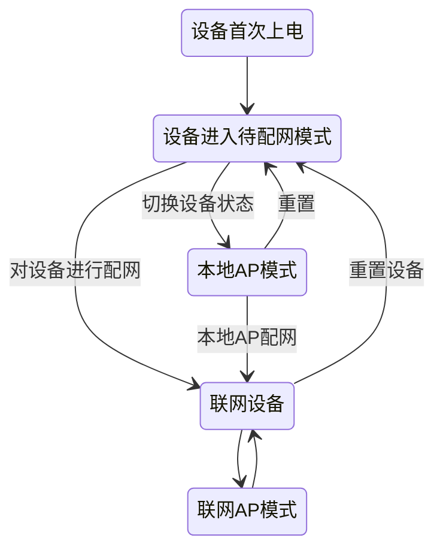

```mermaid
stateDiagram
    设备首次上电-->设备进入待配网模式
    设备进入待配网模式-->联网设备:对设备进行配网
    设备进入待配网模式-->本地AP模式:切换设备状态
    联网设备-->设备进入待配网模式:重置设备
    本地AP模式-->联网设备:本地AP配网
    本地AP模式-->设备进入待配网模式:重置
    联网设备-->联网AP模式
    联网AP模式-->联网设备
```